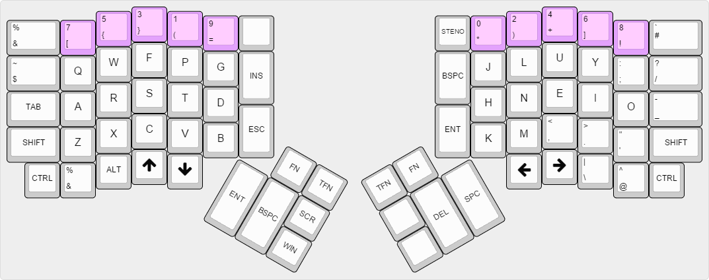
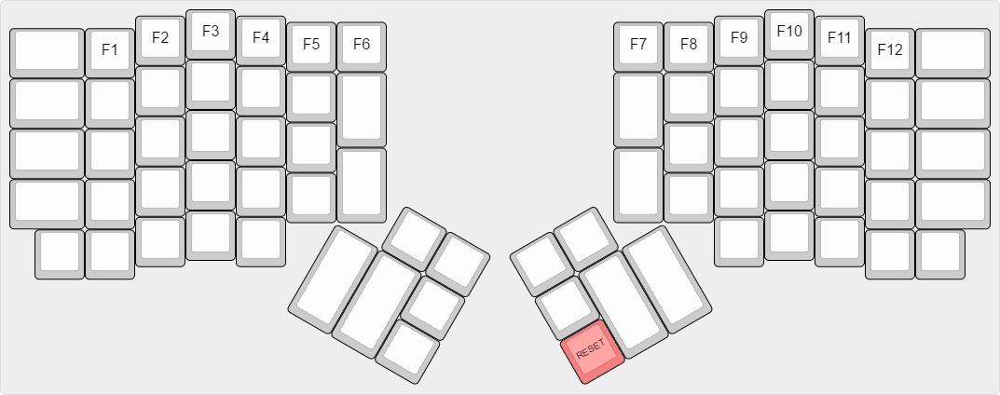
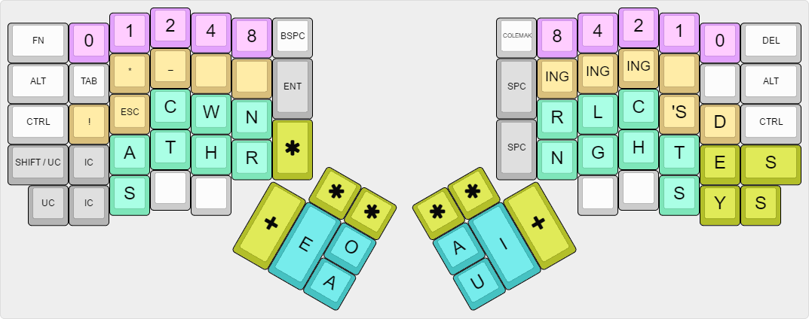
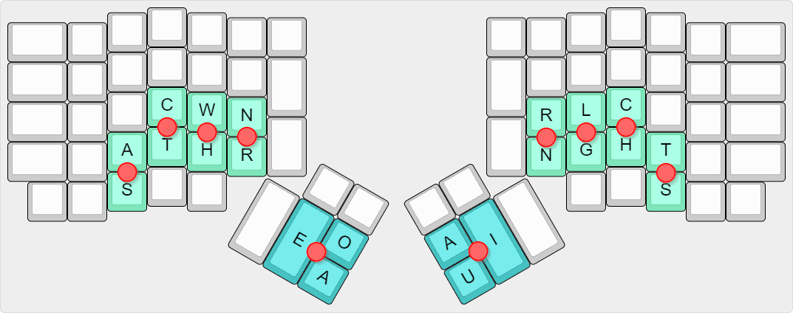
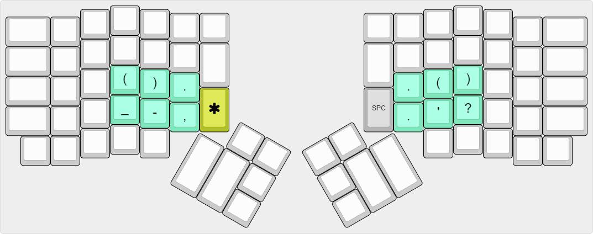

## Summary

It's a firmware-implemented custom Programmer Colemak layout and a firmware-implemented custom Programmer Steno layout (no Plover needed)

## Downloads

You can directly download .hex files from the release page : https://github.com/FromtonRouge/qmk_firmware/releases

## Programmer Colemak layout

(Inspired by the Programmer Dvorak layout : http://www.kaufmann.no/roland/dvorak)

It's basically a Colemak layout with the Programmer Dvorak numbers and symbols row.

## Fn Layer

The TEENSY key (RESET) is define in this layer

## Programmer Steno layout (experimental)

(Inspired by the Jackdaw steno theory https://sites.google.com/site/ploverdoc/jackdaw)

Numbers are binary numbers : you can stroke 2 numbers at the same time (from 0 to 15 for each hand)

Home position :    
    

Punctuations (when * is used with the left or/and right hand) [WORK IN PROGRESS]:

### Lookup table for the left hand (Shelton table)

    A               =       A                   [1]
    AB              =       A|C|T|W|H           [61]
    ABB             =       A|S|C|T|W|H         [63]
    ABBR            =       A|S|C|T|W|H|R       [191]
    ABL             =       A|C|T|W|H|N|R       [253]
    ABR             =       A|C|T|W|H|R         [189]
    ABY             =       A|C|T|W|H|N         [125]
    AC              =       A|C                 [5]
    ACC             =       A|C|H|N             [101]
    ACCL            =       A|C|H|N|R           [229]
    ACCR            =       A|C|H|R             [165]
    ACH             =       A|C|H               [37]
    ACL             =       A|C|N|R             [197]    not in the original Shelton table
    ACKN            =       A|T|W|H|N           [121]
    ACQ             =       A|C|T|N|R           [205]
    ACR             =       A|C|R               [133]
    AD              =       A|C|T               [13]
    ADD             =       A|C|T|W             [29]
    ADDL            =       A|C|T|W|N|R         [221]
    ADDR            =       A|C|T|W|R           [157]
    ADJ             =       A|S|C|T|W|N         [95]
    ADM             =       A|C|T|W|N           [93]
    ADR             =       A|C|T|R             [141]
    ADV             =       A|C|T|N             [77]
    AF              =       A|C|T|H             [45]
    AFF             =       A|C|T|H|N           [109]
    AFFL            =       A|S|C|T|H|N|R       [239]
    AFFR            =       A|S|C|T|H|R         [175]
    AFL             =       A|C|T|H|N|R         [237]
    AFR             =       A|C|T|H|R           [173]
    AFT             =       A|S|C|T|H|N         [111]
    AG              =       A|S|C|T             [15]
    AGG             =       A|S|C|T|W           [31]
    AGGL            =       A|S|C|T|W|N|R       [223]
    AGGR            =       A|S|C|T|W|R         [159]
    AGH             =       A|S|C|T|H           [47]
    AGL             =       A|S|C|T|N|R         [207]
    AGN             =       A|S|C|T|N           [79]
    AGR             =       A|S|C|T|R           [143]
    AH              =       A|H                 [33]
    AJ              =       A|T|W|N             [89]
    AK              =       A|T|W|H             [57]
    AL              =       A|N|R               [193]
    ALL             =       A|W|N|R             [209]
    AM              =       A|W|N               [81]
    AMM             =       A|C|W|N             [85]
    AN              =       A|N                 [65]
    ANN             =       A|S|N               [67]
    AP              =       A|C|W               [21]
    APH             =       A|C|W|H             [53]
    APHR            =       A|C|W|H|R           [181]
    APL             =       A|C|W|N|R           [213]
    APP             =       A|S|C|W|N           [87]
    APPL            =       A|S|C|W|N|R         [215]
    APPR            =       A|S|C|W|R           [151]
    APR             =       A|C|W|R             [149]
    AQ              =       A|T|N|R             [201]
    AR              =       A|R                 [129]
    ARR             =       A|S|R               [131]
    AS              =       A|S                 [3]
    ASC             =       A|S|C               [7]
    ASCR            =       A|S|C|R             [135]
    ASH             =       A|S|H               [35]
    ASK             =       A|S|T|W|H           [59]
    ASL             =       A|S|N|R             [195]
    ASM             =       A|S|W|N             [83]
    ASP             =       A|S|C|W             [23]
    ASPH            =       A|S|C|W|H           [55]
    ASPHY           =       A|S|C|W|H|N         [119]
    ASQ             =       A|S|T|N|R           [203]
    ASS             =       A|S|C|N             [71]
    AST             =       A|S|T               [11]
    ASTH            =       A|S|T|H             [43]
    ASY             =       A|S|H|N             [99]
    AT              =       A|T                 [9]
    ATH             =       A|T|H               [41]
    ATHL            =       A|T|H|H|R           [169]
    ATR             =       A|T|R               [137]
    ATT             =       A|T|W               [25]
    ATTR            =       A|T|W|R             [153]
    AV              =       A|T|N               [73]
    AW              =       A|W                 [17]
    AWH             =       A|W|H               [49]
    AX              =       A|S|T|W             [27]
    AY              =       A|H|N               [97]
    AZ              =       A|C|N               [69]
    B               =       C|T|W|H             [60]
    BL              =       C|T|W|H|N|R         [252]
    BR              =       C|T|W|H|R           [188]
    BY              =       C|T|W|H|N           [124]
    C               =       C                   [4]
    CH              =       C|H                 [36]
    CHR             =       C|H|R               [164]
    CL              =       C|N|R               [196]
    CR              =       C|R                 [132]
    CRY             =       C|H|N|R             [228]
    CY              =       C|H|N               [100]
    D               =       C|T                 [12]
    DEL             =       C|T|N|R             [204]
    DEM             =       C|T|W|N             [92]
    DER             =       C|T|W|R             [156]
    DEV             =       C|T|N               [76]
    DR              =       C|T|R               [140]
    DW              =       C|T|W               [28]
    DY              =       C|T|H|N             [108]
    F               =       C|T|H               [44]
    FL              =       C|T|H|N|R           [236]
    FR              =       C|T|H|R             [172]
    G               =       S|C|T               [14]
    GH              =       S|C|T|H             [46]
    GL              =       S|C|T|N|R           [206]
    GN              =       S|C|T|N             [78]
    GR              =       S|C|T|R             [142]
    GW              =       S|C|T|W             [30]
    GY              =       S|C|T|H|N           [110]
    H               =       H                   [32]
    J               =       T|W|N               [88]
    JER             =       T|W|N|R             [216]
    K               =       T|W|H               [56]
    KL              =       T|W|H|N|R           [248]
    KN              =       T|W|H|N             [120]
    KR              =       T|W|H|R             [184]
    L               =       N|R                 [192]
    LY              =       H|N|R               [224]
    M               =       W|N                 [80]
    MR              =       W|N|R               [208]
    MY              =       W|H|N               [112]
    N               =       N                   [64]
    P               =       C|W                 [20]
    PH              =       C|W|H               [52]
    PHL             =       C|W|H|N|R           [244]
    PHR             =       C|W|H|R             [180]
    PL              =       C|W|N|R             [212]
    PN              =       C|W|N               [84]
    PR              =       C|W|R               [148]
    PY              =       C|W|H|N             [116]
    Q               =       T|N|R               [200]
    R               =       R                   [128]
    RH              =       H|R                 [160]
    S               =       S                   [2]
    SC              =       S|C                 [6]
    SCH             =       S|C|H               [38]
    SCR             =       S|C|R               [134]
    SER             =       S|R                 [130]
    SERV            =       S|T|W|N|R           [218]
    SH              =       S|H                 [34]
    SHR             =       S|H|R               [162]
    SK              =       S|T|W|H             [58]
    SL              =       S|N|R               [194]
    SLY             =       S|H|N|R             [226]
    SM              =       S|W|N               [82]
    SN              =       S|N                 [66]
    SP              =       S|C|W               [22]
    SPH             =       S|C|W|H             [54]
    SPL             =       S|C|W|N|R           [214]
    SPR             =       S|C|W|R             [150]
    SPY             =       S|C|W|H|N           [118]
    SQ              =       S|T|N|R             [202]
    SS              =       S|C|N               [70]
    ST              =       S|T                 [10]
    STR             =       S|T|R               [138]
    STRY            =       S|T|H|N|R           [234]
    STY             =       S|T|H|N             [106]
    SV              =       S|T|N               [74]
    SW              =       S|W                 [18]
    SY              =       S|H|N               [98]
    T               =       T                   [8]
    TH              =       T|H                 [40]
    THR             =       T|H|R               [168]
    TR              =       T|R                 [136]
    TRY             =       T|H|N|R             [232]
    TW              =       T|W                 [24]
    TY              =       T|H|N               [104]
    V               =       T|N                 [72]
    W               =       W                   [16]
    WH              =       W|H                 [48]
    WR              =       W|R                 [144]
    X               =       S|T|W               [26]
    XR              =       S|T|W|R             [154]
    XY              =       S|T|W|H|N           [122]
    Y               =       H|N                 [96]
    Z               =       C|N                 [68]

### Lookup table for thumbs vowels

    A               =       A                   [4]
    AI              =       A|I                 [20]
    AU              =       A|U                 [12]
    AUI             =       A|U|I               [28]
    E               =       E                   [1]
    EA              =       E|A                 [5]
    EAI             =       E|A|I               [21]
    EAU             =       E|A|U               [13]
    EAUI            =       E|A|U|I             [29]     Find something usefull here
    EI              =       E|I                 [17]
    EO              =       E|O                 [3]
    EOA             =       E|O|A               [7]
    EOAI            =       E|O|A|I             [23]     Find something usefull here
    EOAU            =       E|O|A|U             [15]     Find something usefull here
    EOAUI           =       E|O|A|U|I           [31]     Find something usefull here
    EOI             =       E|O|I               [19]
    EOU             =       E|O|U               [11]
    EOUI            =       E|O|U|I             [27]     Find something usefull here
    EU              =       E|U                 [9]
    EUI             =       E|U|I               [25]
    I               =       I                   [16]
    O               =       O                   [2]
    OA              =       O|A                 [6]
    OAI             =       O|A|I               [22]
    OAU             =       O|A|U               [14]
    OAUI            =       O|A|U|I             [30]     Find something usefull here
    OI              =       O|I                 [18]
    OU              =       O|U                 [10]
    OUI             =       O|U|I               [26]
    U               =       U                   [8]
    UI              =       U|I                 [24]

### Lookup table for vowels bigrams (when * is used with vowels)

    AA              =       A                   [4]
    AE              =       E|A                 [5]
    AIU             =       A|U|I               [28]
    AO              =       O|A                 [6]
    EAIU            =       E|A|U|I             [29]    Find something usefull here
    EAO             =       E|O|A               [7]
    EE              =       E                   [1]
    EIA             =       E|A|I               [21]
    EIO             =       E|O|I               [19]
    EIU             =       E|U|I               [25]
    EOAIU           =       E|O|A|U|I           [31]    Find something usefull here
    EOIA            =       E|O|A|I             [23]    Find something usefull here
    EOIU            =       E|O|U|I             [27]    Find something usefull here
    EOUA            =       E|O|A|U             [15]    Find something usefull here
    EUA             =       E|A|U               [13]
    EUO             =       E|O|U               [11]
    IA              =       A|I                 [20]
    IE              =       E|I                 [17]
    II              =       I                   [16]
    IO              =       O|I                 [18]
    IU              =       U|I                 [24]
    OAIU            =       O|A|U|I             [30]    Find something usefull here
    OE              =       E|O                 [3]
    OIA             =       O|A|I               [22]
    IOU             =       O|U|I               [26]    IOU instead of OIU (OIU never happens)
    OO              =       O                   [2]
    OUA             =       O|A|U               [14]
    UA              =       A|U                 [12]
    UE              =       E|U                 [9]
    UO              =       O|U                 [10]
    UU              =       U                   [8]

### Lookup table for the right hand (Shelton table)

    B               =       G|C                 [24]
    BL              =       L|G|C               [28]
    BLES            =       L|G|C|S             [156]
    BS              =       G|C|S               [152]
    BT              =       N|G|C|T             [90]
    BTS             =       N|G|C|T|S           [218]
    C               =       C                   [16]
    CH              =       C|H                 [48]
    CK              =       G|C|T               [88]
    CKL             =       L|G|C|T             [92]
    CKLES           =       L|G|C|T|S           [220]
    CKS             =       G|C|T|S             [216]
    CS              =       C|S                 [144]
    CT              =       C|T                 [80]
    CTS             =       C|T|S               [208]
    D               =       C|H|S               [176]
    D               =       N|L|G               [14]
    DG              =       G|C|H|S             [184]
    DL              =       R|N|L|G             [15]
    DS              =       C|H|T|S             [240]
    DS              =       N|L|G|S             [142]
    DTH             =       N|L|G|H|T           [110]
    DTHS            =       N|L|G|H|T|S         [238]
    F               =       G|C|H               [56]
    FT              =       G|C|H|T             [120]
    FTEN            =       N|G|C|H|T           [122]   not in the original Shelton table 
    FTER            =       R|G|C|H|T           [121]   not in the original Shelton table
    G               =       G                   [8]
    GG              =       N|G|C               [26]
    GGS             =       N|G|C|S             [154]
    GH              =       G|H                 [40]
    GHS             =       G|H|S               [168]
    GHT             =       G|H|T               [104]
    GHTS            =       G|H|T|S             [232]
    GN              =       R|N|G               [11]
    GNS             =       R|N|G|S             [139]
    GS              =       G|S                 [136]
    H               =       H                   [32]
    HS              =       H|S                 [160]
    K               =       G|T                 [72]
    KL              =       L|G|T               [76]
    KS              =       G|T|S               [200]
    L               =       L                   [4]
    LB              =       R|N|L|G|C           [31]
    LBS             =       R|N|L|G|C|S         [159]
    LCH             =       R|N|L|C|H           [55]
    LD              =       R|N|L|C|H|S         [183]
    LDS             =       R|N|L|C|H|T|S       [247]
    LF              =       L|G|C|H             [60]
    LG              =       L|G                 [12]
    LK              =       R|N|L|G|T           [79]
    LKS             =       R|N|L|G|T|S         [207]
    LL              =       R|N|L               [7]
    LLS             =       R|N|L|S             [135]
    LM              =       R|N|L|G|H           [47]
    LMS             =       R|N|L|G|H|S         [175]
    LP              =       R|N|L|C|T           [87]
    LPS             =       R|N|L|C|T|S         [215]
    LS              =       L|S                 [132]
    LT              =       L|T                 [68]
    LTH             =       L|H|T               [100]
    LTS             =       L|T|S               [196]
    LV              =       R|N|L|H             [39]
    LVES            =       R|N|L|H|S           [167]
    M               =       N|G|H               [42]
    MB              =       N|G|C|H             [58]
    MBER            =       R|N|G|C|H           [59]    not in the original Shelton table
    MBERS           =       R|N|G|C|H|S         [187]   not in the original Shelton table
    MBS             =       N|G|C|H|S           [186]
    MP              =       N|L|G|C|H           [62]
    MPS             =       N|L|G|C|H|S         [190]
    MPT             =       N|L|G|C|H|T         [126]
    MPTS            =       N|L|G|C|H|T|S       [254]
    MS              =       N|G|H|S             [170]
    N               =       N                   [2]
    NC              =       N|C                 [18]
    NCES            =       N|C|S               [146]
    NCH             =       N|C|H               [50]
    ND              =       N|C|H|S             [178]
    NDS             =       N|C|H|T|S           [242]
    NG              =       N|G                 [10]
    NGS             =       N|G|S               [138]
    NGTH            =       N|G|T|H             [106]
    NGTHS           =       N|G|H|T|S           [234]
    NK              =       N|G|T               [74]
    NKS             =       N|G|T|S             [202]
    NS              =       N|S                 [130]
    NST             =       N|L|C|T             [86]
    NT              =       N|T                 [66]
    NTH             =       N|H|T               [98]
    NTHS            =       N|H|T|S             [226]
    NTS             =       N|T|S               [194]
    P               =       L|C                 [20]
    PH              =       L|C|H               [52]
    PHS             =       L|C|H|S             [180]
    PL              =       R|N|L|C             [23]
    PLES            =       R|N|L|C|S           [151]
    PS              =       L|C|S               [148]
    PT              =       L|C|T               [84]
    PTH             =       L|C|H|T             [116]
    PTHS            =       L|C|H|T|S           [244]
    R               =       R                   [1]
    RB              =       R|G|C               [25]
    RBS             =       R|G|C|S             [153]
    RC              =       R|C                 [17]
    RCH             =       R|C|H               [49]
    RCS             =       R|C|S               [145]
    RD              =       R|C|H|S             [177]
    RDS             =       R|C|H|T|S           [241]
    RF              =       R|G|C|H             [57]
    RG              =       R|G                 [9]
    RGH             =       R|G|H               [41]
    RGS             =       R|G|S               [137]
    RK              =       R|G|T               [73]
    RKS             =       R|G|T|S             [201]
    RL              =       R|L                 [5]
    RLD             =       R|L|C|H|S           [181]
    RLDS            =       R|L|C|H|T|S         [245]
    RLS             =       R|L|S               [133]
    RM              =       R|N|G|H             [43]
    RMS             =       R|N|G|H|S           [171]
    RN              =       R|N                 [3]
    RNS             =       R|N|S               [131]
    RNT             =       R|N|T               [67]
    RP              =       R|L|C               [21]
    RPS             =       R|L|C|S             [149]
    RS              =       R|S                 [129]
    RST             =       R|N|L|T             [71]
    RSTS            =       R|N|L|T|S           [199]
    RT              =       R|T                 [65]
    RTH             =       R|H|T               [97]
    RTHS            =       R|H|T|S             [225]
    RTS             =       R|T|S               [193]
    RV              =       R|N|C|H             [51]
    S               =       N|L                 [6]
    S               =       S                   [128]
    SH              =       N|L|H               [38]
    SHES            =       N|L|H|S             [166]
    SK              =       N|L|G|T             [78]
    SKS             =       N|L|G|T|S           [206]
    SM              =       N|L|G|H             [46]
    SMS             =       N|L|G|H|S           [174]
    SP              =       N|L|C               [22]
    SPS             =       N|L|C|S             [150]
    SS              =       N|L|S               [134]
    ST              =       N|L|T               [70]
    STS             =       N|L|T|S             [198]
    T               =       T                   [64]
    TCH             =       C|H|T               [112]
    TH              =       H|T                 [96]
    THS             =       H|T|S               [224]
    TION            =       N|C|T               [82]
    TIONS           =       N|C|T|S             [210]   not in the original Shelton table
    TS              =       T|S                 [192]
    V               =       N|H                 [34]
    VES             =       N|H|S               [162]
    W               =       R|H                 [33]
    WD              =       R|N|C|H|S           [179]
    WDS             =       R|N|C|H|T|S         [243]
    WK              =       R|G|H|T             [105]
    WKS             =       R|G|H|T|S           [233]
    WL              =       R|L|H               [37]
    WLS             =       R|L|H|S             [165]
    WN              =       R|N|H               [35]
    WNS             =       R|N|H|S             [163]
    WS              =       R|H|S               [161]
    WTH             =       R|N|H|T             [99]
    WTHS            =       R|N|H|T|S           [227]
    X               =       L|G|H               [44]
    XES             =       L|G|H|S             [172]
    XT              =       L|G|H|T             [108]
    Z               =       L|H                 [36]
    ZES             =       L|H|S               [164]

### Lookup table for right pinky

    E               =       E                   [1]
    ES              =       E|S                 [5]
    EY              =       E|Y                 [3]
    EYS             =       E|Y|S               [7]
    S               =       S                   [4]
    Y               =       Y                   [2]
    YS              =       Y|S                 [6]

### Lookup table for user left punctuations (when * is used with the left hand)

    [WORK IN PROGRESS]

### Lookup table for user right punctuations (when * is used with the right hand)

    [WORK IN PROGRESS]

### Lookup table for left user symbols and punctuations

    [WORK IN PROGRESS]

    !                   =       0                   [1]   
    ESC                 =       1                   [2]     For Vim
    ESC:                =       0|1                 [3]     For Vim
    *                   =       2                   [4]
    _                   =       3                   [8]     Usefull for prefixing an attribute member in C++ (eg: _p)       Usefull for prefixing an attribute member in C++ (ed: _p)

### Lookup table for right user symbols and punctuations

    [WORK IN PROGRESS]

    D                   =       0                   [1]     For words ending with ED
    'S                  =       1                   [2]     Main control key for english contractions ('s, n't, 'll etc...)
    D                   =       0|1                 [3]     For words ending with TED THED
    N'T                 =       1|2                 [6]
    ING                 =       3                   [8]     For words ending with ING
    'LL                 =       1|3                 [10]   
    ER                  =       2|3                 [12]    For words ending with ER
    ING                 =       4                   [16]    For words ending with ING
    'VE                 =       1|4                 [18]
    ER                  =       3|4                 [24]    For words ending with ER
    ING                 =       5                   [32]    For words ending with ING
    'D                  =       1|5                 [34]
    ER                  =       4|5                 [48]    For words ending with ER

