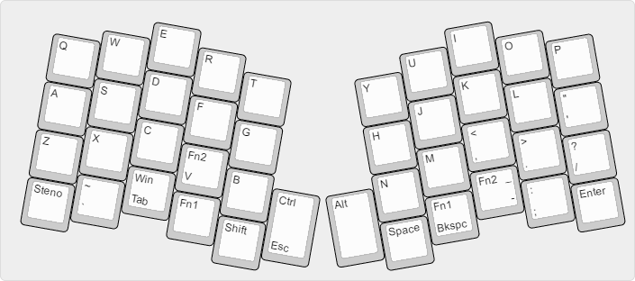
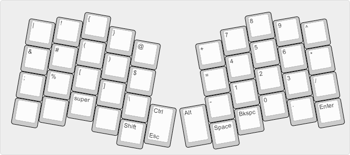
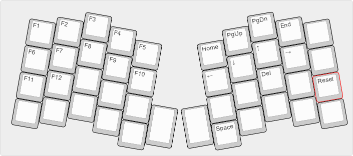
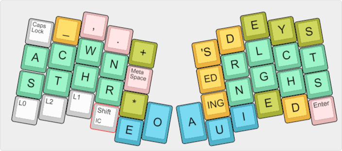

## Summary

This implements layers for the [Atreus](https://atreus.technomancy.us/) keyboard. It uses dual-use keys liberally, and it includes a chording/steno layout based on [Jackdaw](https://sites.google.com/site/ploverdoc/jackdaw). 

## Main layer

## Symbol/numpad layer

## Fn/movement layer

The TEENSY key (RESET) is define in this layer

## Steno layer (experimental)

This was derived from the great work by Vissale Neang (GitHub user FromtonRouge) on his [Ergodox
layout](https://github.com/FromtonRouge/qmk_firmware/tree/master/keyboard/ergodox_ez/keymaps/fromtonrouge).
See that page for more complete information on key combinations. 
Jackdaw was developed mainly by [Jennifer Brien](https://groups.google.com/forum/?fromgroups#!topic/ploversteno/C42uhF0P8WI). 

Here is a cheat sheet with some of the nonobvious [Shelton chords](http://www.google.com/patents/US3970185) included ([pdf](jackdaw-cheatsheet.pdf)).

I added a few chords on the right side that are not in the Shelton spec: LD = LGCHS, LDS = LGCHTS, and NL = NLGC.

Two spacing modes are provided that control entry of spaces:

* *Space mode* -- The default mode. A trailing space is added after each chord. This is useful because most common words can be typed in one chord. 
* *No-space mode* -- No spaces are added.

Used alone, the "Meta-Space" key toggles between these two spacing modes. If the Meta-Space key is used with a chord, it toggles the spacing mode just for that chord. When the Meta-Space key is used alone to enable Space mode, a space is inserted. 

